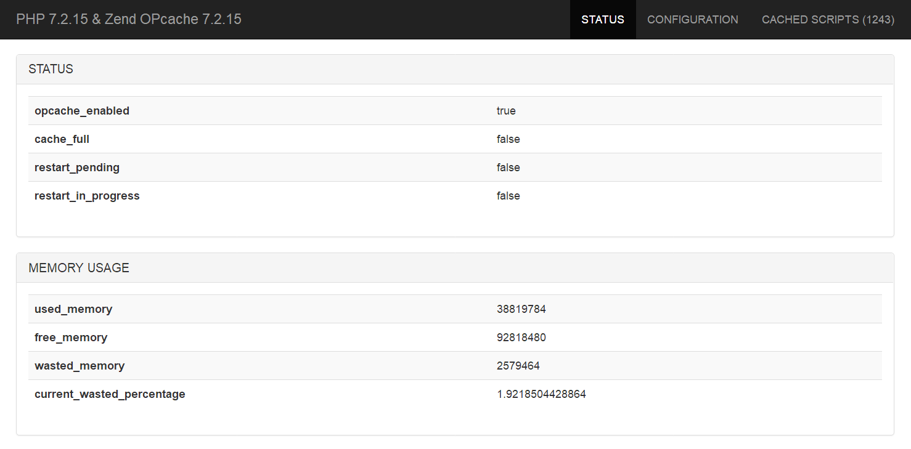

## Laravel Opcache Gui

#### 此包是在没找到好用的Laravel Opcache集成包开发的


## INSTALL

composer
```php
php composer.phar require aping/laravel-opcache-gui
```
或
```php
"require": {
    "aping/laravel-opcache-gui": "dev-master"
}
```

## CONFIG

### Laravel 5.5+:

Add Service Provider to config/app.php in providers section
```bash
Aping\LaravelOpcacheGui\OpcacheServiceProvider::class,
```

publish
```php
php artisan vendor:publish --provider="Aping\LaravelOpcacheGui\OpcacheServiceProvider"
```

Add a route in your web routes file
```php
Route::get('opcache', '\Aping\LaravelOpcacheGui\Controllers\OpcacheController@index');
```

Go to http://myapp/opcache or some other route

## TODO

- 完善图表 & 清除