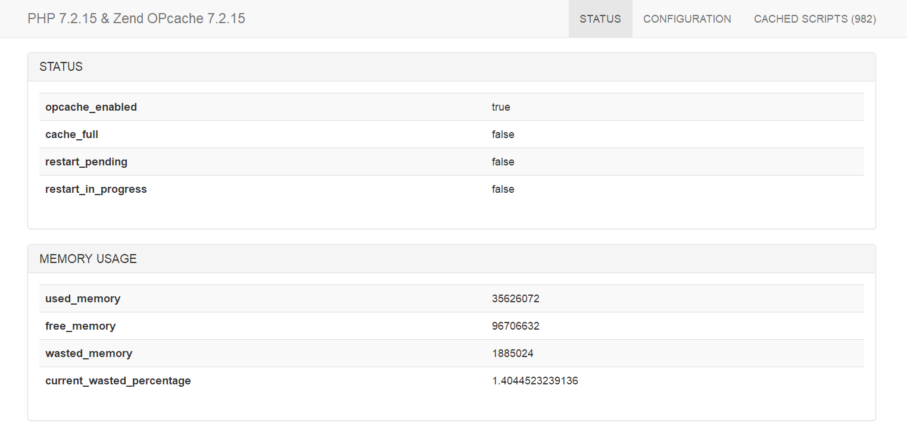

## Laravel Opcache Gui

#### 此包是在没找到好用的Laravel Opcache集成包开发的


## INSTALL

composer
```bash
php composer.phar require aping/laravel-opcache-gui
```
或
```bash
"require": {
    "aping/laravel-opcache-gui": "dev-master"
}
```

配置路由 & 访问/opcache或自定义路径
```bash
Route::get('opcache', '\Aping\LaravelOpcacheGui\Controllers\OpcacheController@index');
```

## TODO

- 完善图表 & 清除